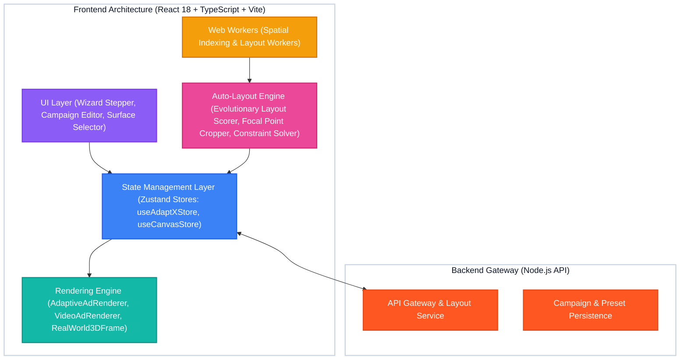

<h1 align="center">AdaptX Engine</h1>
<h1 align="center">Adaptive Layout Engine for Multi-Surface Ads</h1>

<p align="center">
  <span style="color: #ffffff;"><b>Live Application:</b></span>
  <a href="https://adapt-x-engine.vercel.app/">https://adapt-x-engine.vercel.app/</a>
  <br>
  <span style="color: #ffffff;"><b>GitHub Repository:</b></span>
  <a href="https://github.com/SonaRajarajan/AdaptX-Engine">https://github.com/SonaRajarajan/AdaptX-Engine</a>
</p>

<br>

<div align="center">

<b>Name : V R Sona</b>
<br>
<b>Reg No: 22MIA1161</b>

</div>


## Quick Start Execution

Run both the Real-Time Backend API and AdaptX Engine Frontend concurrently with a single command:

```bash
# 1. Clone the repository
git clone https://github.com/SonaRajarajan/AdaptX-Engine.git
cd AdaptX-Engine

# 2. Run both Frontend & Backend concurrently
./run_app.sh
```

- **Deployed Live Vercel Web App:** https://adapt-x-engine.vercel.app/
- **API Health Check:** http://localhost:8000/api/health

---

## System Architecture



---

## Features

- **Multi-Surface Adaptation**: Real-time reflowing across (9:16, 16:9, 1:1, 32:9, 4:5, 3:4, Smartwatch, Cockpit).
- **Static Poster Ad Renderer**: Smart typography hierarchy, focal point cropper & custom shape cuts.
- **Video Commercial Ads Engine**: 12 commercial presets with motion dynamics, particle physics & animated glitch effects.
- **3D Spatial Environment Simulator**: Preview ads rendered as real-world 3D devices (iPhone 16 Pro, MacBook, 4K TV, City Billboard).
- **Integrated Export Engine**: 1-click PNG image export for static posters and 1-click MP4 commercial video export.
- **A/B Comparison & Layout Genome**: Side-by-side creative variation matrix and raw layout DNA parameter inspector.
- **Automated Accessibility Audit**: Real-time WCAG color contrast auditing and font legibility constraint checks.
- **Multi-Vibe Aesthetic Engine**: Instant design theme switching (Neobrutalist, Cyberpunk, Organic Pastel, Glassmorphism, Clean).

---

## Application Screenshots

# 1. Homepage of Multi-Surface Ads Platform


# > Static Poster Ad Editor


# > Video Commercial Ad Builder


# 2. Multi-Surface Geometry Format Selection


# 3. AI-Powered Adaptive Template Generation


# 4. Motion Preset & Animation Selection 


# 5. Campaign Setup & Product Configuration with Cursor Drag


# 7. 3D Real-World Ad Preview
# > Phone


# > Smartwatch


# 8. Layout Genome & Parameter Inspector


# 9. Adaptive Multi-Surface Ads


# 10. A/B Creative Variation Comparison


# 11. Multi-Vibe Theme & Aesthetic Selection


# 12. Dynamic Typography & Focal Point Adjustment


# 13. Save and Download Campaign & Surface Presets


---

## Core Platform Capabilities

### 1. Multi-Surface Contextual Adaptation
- Automatically scales and reflows creative assets across 8 distinct device aspect ratios (9:16 Portrait, 16:9 Landscape, 1:1 Square, 32:9 Ultra-wide, etc.).
- Evaluates visual contrast, legibility, and WCAG accessibility standards for each surface.

### 2. Static & Video Commercial Modes
- **Static Poster Mode**: Custom brand color themes, typography hierarchy, product shape cuts, and 3D product popout effects.
- **Video Ads Mode**: 12 commercial presets with motion styles including Holographic Glitch, 360 Degree Orbit, Bounce & Float, Zoom Pulse, and Shimmer Glare.

### 3. Integrated Save & Export Engine
- 1-click PNG image export for static poster layouts.
- 1-click MP4 video export for animated video commercials.
- Direct campaign state saving and surface preset persistence.

---

## Frontend Architecture Overview

- **Campaign Composer** (`Step1CampaignSetup.tsx`): Interactive setup wizard for products, geometry, templates, and motion controls.
- **3D Spatial Simulator** (`DeviceRealWorldModal.tsx`): Real-time 3D spatial device modal with 8 environment presets & 2D/3D popouts.
- **Static Poster Renderer** (`AdaptiveAdRenderer.tsx`): Dynamic poster rendering with brand typography & geometric shape cuts.
- **Video Commercial Renderer** (`VideoAdRenderer.tsx`): High-framerate canvas animation engine with particle physics & MP4 export.
- **Auto-Layout Intelligence** (`src/engine/`): Candidate scoring, constraint solver, smart typography scaling & evolutionary generator.
- **Unified State Store** (`useAdaptXStore.ts`): Central Zustand state tracking active campaign, video presets & themes.

---
## Automated Test Suite

Run the Vitest test suite to verify layout engine calculations and constraint solvers:

```bash
cd frontend
npm test
```


Tested Engine Modules:
- `FocalPointCropper.test.ts`: Smart cropping focal point detection and aspect ratio fitting.
- `ConstraintSolver.test.ts`: Brand guideline and aspect ratio constraint verification.
- `LayoutScoring.test.ts`: Visual hierarchy score metrics calculation.
- `ThemeEngine.test.ts`: Color contrast audit calculations.

---

## Performance Benchmarks

| Metric | Target Benchmark | AdaptX Measured Result |
| :--- | :---: | :---: |
| **Canvas Render Speed** | 60 FPS | **60 FPS** |
| **Spatial Layout Calculation** | <10 ms | **~1.8 ms** |
| **Surface Adaptation Time** | <50 ms | **~12 ms** |
| **Initial Bundle Load** | <2 sec | **~0.4 sec** |

---

## Docker Deployment

Deploy full stack using Docker Compose:

```bash
docker-compose up --build
```
